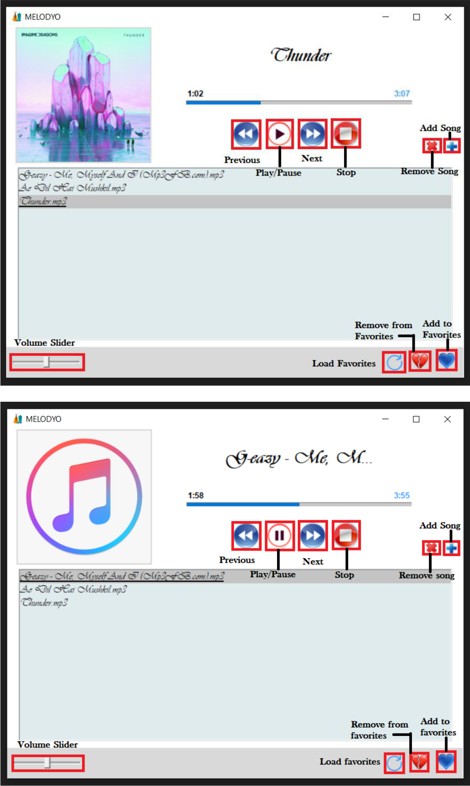

# Music_Player-Python

DESCRIPTION

Melodyo Music Player is built on windows 10 platform 64 bit. Python language version 3.7, 64 bit was used. The GUI of the music application was built using Tkinter module. SQLite3 is used as Database.

FUNCTIONALITIES

Melodyo can perform all the basic functions that are required in a music player. This app is capable of performing the following functions –

•	Play the music : This Button allows the user to play the currently selected song. This button when clicked again selecting the song that is already playing restarts the song.

•	Pause the music : This button is used to pause the song that is currently being played and can also use to continue playing the song from there itself instead of playing it from the beginning.

•	Play the previous song : This button is used to play the previous song that is placed before the song which is currently being played.

•	Stop the song : This button is just like the pause button but here the song gets completely stopped and on playing the song it will start from the beginning.

•	Add a song to the list : This button takes the selected song name along with its path from local storage and displays the song name in the list. User can play the song using the play button.

•	Remove a song from the list : This button is use to remove the song from the list. It erases both the path and the name from the display and the list.

•	Add songs to favorite : This button allows the user to add a song which is his/her favorite. The song gets saved in tabular form in music.db locally. The table consist of a Song Id, Song Name and Song Path. If a song is already present in the favorites, it displays “song already present in the favorites”.

•	Remove songs from favorite : This button is used to removes a song from the favorite table. If the song is not present in the favorite table then it displays “Song not present in Favorites”.

•	Load songs from the favorite : This button brings all the songs that are stored as user’s favorites to the list. Now user can play his/her favorite songs. If there are no songs present in the favorites, then it displays “No songs present in favorites”.

•	Volume adjustment : This slider is used to increase or decrease the volume of the song being played. The volume has a range from 0 to 100 where 0 being zero volume and 100 being the maximum volume. Initially when a song is played the scale is set to 50 volume by default.

MVC ARCHITECTURE

The Model-View-Controller (MVC) is an architectural pattern that separates an application into three main logical components: the model, the view, and the controller. Each of these components are built to handle specific development aspects of an application.

•   Model - The Model component corresponds to all the data-related logic that the user works with. This can represent either the data that is being transferred between the View and Controller components or any other business logic-related data.

•   View - The View component is used for all the UI logic of the application. This component is used to create the GUI of the application.

•   Controller - Controllers act as an interface between Model and View components to process all the business logic and incoming requests, manipulate data using the Model component and interact with the Views to render the final output.

FILE DESCRIPTION

•	Model.py - This file can be represented as the MODEL if the MVC architecture. It contains class name Model which include various functions in it. This file uses SQLite3 as a database organiser. This file helps in database connection, creation of table, insertion of a row in table, deletion of a row in table, selecting contents from the table etc.

•	Melodyo.py - This file can be represented as the VIEW of the MVC architecture. It contains the GUI of the music player which includes a window on which buttons, labels, scrolled list box, progress bar etc. to make the GUI much more interactive. Each button is associated with a function which “on-click” triggers an event.

•	Player.py - This file can be represented as the CONTROLLER of the MVC architecture. It contains a class Player which has various functions in it. The event triggered by the view/melodyo.py is controlled by the functions of this file and if the event needs the usage of database, the event is sent to model.py for further execution.
